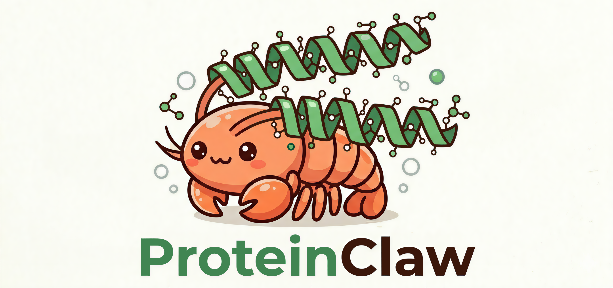

# ProteinClaw



The AI agent for protein bioinformatics. Describe your research goal in plain English — ProteinClaw figures out which tools to call, runs them, and streams a synthesized answer back to you.


---

## Why ProteinClaw?

Protein research spans dozens of databases — UniProt, BLAST, ClinVar, gnomAD, GTEx, cBioPortal, and more. Moving data between them manually is slow, error-prone, and hard to reproduce.

ProteinClaw replaces that pipeline with a single conversational interface backed by a ReAct agent loop. You describe what you want; the agent decides which tools to call, calls them in sequence, and synthesizes the results into a coherent answer.

- **No scripting.** Natural language in, structured results out.
- **Multi-tool reasoning.** The agent chains tools automatically when your question requires it.
- **Streaming output.** See tool calls, intermediate observations, and the final answer as they happen.
- **Your LLM.** Works with OpenAI, Anthropic, DeepSeek, MiniMax, or a local Ollama model.
- **Your data stays on your machine.** ProteinClaw runs entirely on your own computer. Your queries, results, and API keys never pass through any third-party server — nothing is collected, logged, or shared. Use a local Ollama model and no data leaves your machine at all.

---

## What's Included

### The Agent Core

A ReAct loop (`proteinclaw/core/agent/`) that drives all three interfaces:

| Component | What it does |
|-----------|--------------|
| `loop.py` | Thought → Tool Call → Observation cycle, up to 10 steps |
| `llm.py` | LiteLLM-based multi-model router with async streaming |
| `prompt.py` | System prompt builder — injects available tools at runtime |
| `events.py` | Typed event stream: `ToolCallEvent`, `ObservationEvent`, `TokenEvent`, `DoneEvent`, `ErrorEvent` |

### Three Interfaces

| Interface | How to launch | Best for |
|-----------|--------------|----------|
| **Terminal UI** | `proteinclaw` | Interactive multi-turn research sessions |
| **One-shot CLI** | `proteinclaw query "..."` | Scripting, pipelines, quick lookups |
| **Desktop App** | Tauri `.dmg` / `.exe` | Non-technical users, GUI workflow |

### ProteinBox — the Tool Layer

All database integrations live in `proteinbox/api_tools/`. Each tool is independently testable and auto-discovered by the agent at startup. 35 tools across 9 categories. See [Supported Tools](#supported-tools) for the full list.

---

## Usage Examples

### Comprehensive Research Demo — EGFR from every angle

A single interactive session walking through all tool categories. The agent automatically chains tools based on each question.

```
proteinclaw

> What is EGFR and what does it look like structurally?
  [tool: uniprot]       P00533 — EGFR_HUMAN, receptor tyrosine kinase, 1210 aa, chr 7p11.2
  [tool: interpro]      4 domains: Furin-like (×2), Receptor L-domain, Pkinase_Tyr
  [tool: panther]       PTHR24416:SF85 — Epidermal growth factor receptor; protein class: Receptor kinase
  [tool: alphafold]     AF-P00533-F1, pLDDT 87.4 (high confidence), full-length model available
  [tool: pdb]           7JXR (1.9 Å X-ray, erlotinib-bound), 3NJP (2.8 Å, gefitinib-bound)
  [tool: cath]          Kinase domain: 3.30.200.20 (Alpha Beta / Sandwich / Protein Kinase)
  [tool: scopedb]       d.144.1.7 — Protein kinase-like (PK-like) superfamily
  [tool: opm]           Single-pass type I membrane protein, tilt angle 26°, hydrophobic thickness 30 Å

> How conserved is EGFR and what orthologs exist?
  [tool: eggnog]        OG: ENOG502S1B9 (Metazoa); COG category: T (Signal transduction); 847 orthologs
  [tool: consurf]       Kinase domain avg conservation grade: 7.9/9; activation loop (T790) grade: 9 (invariant)
  [tool: phylomedb]     Phylome 1: 32 orthologs across 28 species; 1:1 orthologs in mouse, zebrafish, Drosophila

> What are the key EGFR variants and their clinical impact?
  [tool: clinvar]       L858R — Pathogenic (lung adenocarcinoma); T790M — Pathogenic (drug resistance)
  [tool: gnomad]        pLI 1.00, LOEUF 0.14 — highly constrained; missense z-score 4.5
  [tool: uniprot_variants] 287 variants; 14 with clinical significance in kinase domain
  [tool: dbsnp]         rs121434568 (L858R): AF 0.0001, somatic in lung cancer; rs28929495 (T790M)
  [tool: gwas_catalog]  17 GWAS hits: lung cancer risk (p=3×10⁻¹²), breast cancer susceptibility

> What kinase activity data exists for EGFR?
  [tool: expasy_enzyme] EC 2.7.10.1 — receptor protein-tyrosine kinase; 312 characterized UniProt entries
  [tool: sabio_rk]      Km(ATP) = 18 µM (human, pH 7.4, 37°C); kcat = 0.8 s⁻¹ (EGF-activated form)
  [tool: brenda]        Km(peptide substrate) = 45 µM; optimal pH 7.5; inhibited by erlotinib (IC50 2 nM)

> Where is EGFR expressed at the mRNA and protein level?
  [tool: gtex]          Highest in skin (42 TPM), kidney cortex (38 TPM), bladder (29 TPM)
  [tool: protein_atlas] IHC: strong in liver, kidney, GI tract; subcellular: plasma membrane + endosome
  [tool: paxdb]         Skin: 524 ppm; kidney: 418 ppm; liver: 187 ppm (integrated proteomics)
  [tool: proteomicsdb]  Detected in 57/62 tissues; highest MS intensity in epidermis and placenta

> What complexes does EGFR form?
  [tool: complex_portal] CPX-906 — EGFR homodimer (EGF-activated); CPX-907 — EGFR:ERBB2 heterodimer
  [tool: corum]          Complex 5540 — EGFR signalosome: EGFR, GRB2, SOS1, SHC1, GAB1 (HEK293T)
  [tool: string]         Top partners: ERBB2 (0.999), ERBB3 (0.998), GRB2 (0.994), SRC (0.990)
  [tool: intact]         841 curated interactions; top method: anti-bait coimmunoprecipitation

> What drugs target EGFR and what are their binding affinities?
  [tool: drugbank]       11 approved drugs; erlotinib — reversible ATP-competitive inhibitor (NSCLC)
  [tool: chembl]         147 clinical compounds; 3rd-gen: osimertinib (IC50 1 nM, T790M-selective)
  [tool: bindingdb]      Erlotinib Kd = 0.4 nM; gefitinib Ki = 0.2 nM; osimertinib IC50 = 1 nM
  [tool: dgidb]          34 drug interactions: 28 inhibitors, 3 antibodies (cetuximab, panitumumab)
  [tool: opentargets]    Top disease: non-small cell lung carcinoma (score 0.95); 11 approved drugs

> What PTMs regulate EGFR and what cancer mutations are known?
  [tool: phosphosite]    42 phosphosites; Y1068 (major autophosphorylation); Y1173 (Shc recruitment)
  [tool: dbptm]          87 experimentally verified PTMs: 42 phosphorylation, 18 ubiquitination, 6 acetylation
  [tool: gene_ontology]  BP: transmembrane receptor tyrosine kinase signaling; CC: receptor complex
  [tool: cbioportal]     EGFR altered in 16% NSCLC (L858R 38%, amplification 22%, T790M 15%)
  [tool: disgenet]       top disease: lung neoplasms (score 0.9); 47 disease associations total

> What pathways involve EGFR?
  [tool: reactome]       51 pathways; top: EGFR Signaling (R-HSA-177929), PI3K/AKT Signaling
  [tool: wikipathways]   ErbB signaling (WP673), MAPK cascade (WP382), Focal Adhesion (WP306)
  [tool: kegg]           hsa04012 (ErbB signaling), hsa05223 (non-small cell lung cancer)

> Find recent papers on EGFR resistance mechanisms
  [tool: literature]     Searched PubMed, Europe PMC, Semantic Scholar, CrossRef, bioRxiv, arXiv
                         Top result: "Osimertinib resistance: mechanisms and clinical implications"
                         Nature Reviews Cancer 2024 — 312 citations
  [tool: pubmed]         847 articles for "EGFR resistance"; 43 reviews in last 2 years
```

**Immune gene quick lookup** (uses `imgt`):

```
proteinclaw

> Characterize the IGHV1-2 germline gene
  [tool: imgt]    IGHV1-2*02 — functional allele, chromosome 14q32.33
                  CDR1 length 8 aa, CDR2 length 8 aa; 99.6% identity to IGHV1-2*01
                  Used in 12% of mature B-cell repertoires; associated with anti-VRC01 broadly neutralizing antibodies
```

---

**One-shot mode:**
```bash
proteinclaw query "What clinical variants are reported for BRCA1?"
proteinclaw query --model gpt-4o "Summarize the GTEx expression profile of TP53"
proteinclaw query "Is rs1801133 a pathogenic variant?"
proteinclaw query "What kinetic parameters are known for EC 2.7.10.1?"
proteinclaw query "What drugs bind EGFR and what are their affinities?"
```

---

**Example queries by category:**

| Category | Query | Tools invoked |
|----------|-------|--------------|
| Annotation | `What is P04637?` | `uniprot` → `interpro` → `panther` |
| Structure | `Show me EGFR structures and classify its domains` | `pdb` → `alphafold` → `cath` |
| Sequence | `Find proteins similar to this sequence: <FASTA>` | `blast` → `elm` → `disprot` → `mobidb` |
| Variants | `What variants are reported for BRCA1?` | `clinvar` → `gnomad` → `uniprot_variants` |
| Expression | `Where is TP53 expressed at mRNA and protein level?` | `gtex` → `protein_atlas` |
| Interactions | `Who are EGFR's top interaction partners?` | `string` → `intact` |
| Disease | `What diseases are linked to TP53?` | `opentargets` → `disgenet` → `omim` |
| Cancer | `Tell me about TP53 mutations in lung cancer` | `cbioportal` → `uniprot_variants` |
| Pathways | `What pathways does EGFR participate in?` | `reactome` → `wikipathways` → `kegg` |
| Literature | `Recent papers on EGFR resistance` | `literature` → `pubmed` |

---

### Per-category usage examples

**Protein Annotation — BRCA1**
```
proteinclaw

> Give me a complete annotation for BRCA1 (P38398): function, domains, family, GO terms, and known PTMs.
  [tool: uniprot]         P38398 — BRCA1_HUMAN, DNA repair protein, 1863 aa, chr 17q21.31
                          Function: maintains genomic stability; E3 ubiquitin ligase activity
  [tool: interpro]        BRCT domain (×2) at 1646–1736, 1756–1855; RING-type zinc finger at 8–98
                          Pfam: PF00533 (BRCT), PF13638 (RING_2); PROSITE: PS50172
  [tool: panther]         PTHR11289:SF62 — Breast cancer type 1 susceptibility protein
                          Protein class: DNA binding protein
  [tool: gene_ontology]   MF: ubiquitin-protein transferase, DNA binding, BRCA1 A complex binding
                          BP: DNA repair, double-strand break repair, cell cycle checkpoint
                          CC: nucleus, BRCA1-A complex, PML body
  [tool: phosphosite]     23 phosphosites; S988 (ATM-mediated, DNA damage response)
                          S1387 (CHK2-mediated); S1524 (CDK2); 4 ubiquitination sites
```

**Protein Structure — EGFR**
```
proteinclaw

> What structures exist for the EGFR kinase domain, and how is it classified?
  [tool: pdb]             7JXR — X-ray, 1.9 Å, erlotinib-bound kinase domain (residues 696–1022)
                          3NJP — X-ray, 2.8 Å, gefitinib-bound; 6ARU — cryo-EM, 4.1 Å, full-length dimer
  [tool: alphafold]       AF-P00533-F1 — pLDDT 87.4 (high confidence); residues 1–1210 modeled
                          Fragment 1 (N-terminal EGF-binding domains): pLDDT 82.1
  [tool: cath]            Kinase domain: 3.30.200.20 (Alpha Beta / Sandwich / Protein Kinase)
                          EGF-like domain: 2.10.25.10 (Few Secondary Structures / Immunoglobulin-like)
```

**Sequence & Motifs — Custom sequence**
```
proteinclaw

> For the sequence below, find similar proteins, predict SLiMs, and check for disorder.
  MKTAYIAKQRQISFVKSHFSRQLESSPGNFQTPYGIDRNSTREACLNLLSVAADSQEWE

  [tool: blast]           Top hit: sp|P04637|P53_HUMAN (E-value 3e-8, 72% identity, 55 aa aligned)
                          2nd: sp|P02340|P53_MOUSE (E-value 1e-7, 68% identity)
  [tool: elm]             LIG_SH3_3 at positions 12–17 (binding site)
                          DEG_APCC_DBOX_1 at positions 38–41 (degradation signal)
                          MOD_CDK_SPxK_1 at positions 49–52 (phosphorylation site)
  [tool: disprot]         No validated disordered regions (DisProt contains 0 entries for this sequence)
  [tool: mobidb]          Disorder consensus: low (< 0.2) across full length; structured protein
```

**Variants & Clinical — BRCA2**
```
proteinclaw

> What are the key clinical variants in BRCA2 and how constrained is the gene?
  [tool: clinvar]         BRCA2 (gene ID 675): 4,312 variants submitted
                          Pathogenic: 892 variants (incl. c.5946delT — Fanconi anemia; c.6275_6276del)
                          Likely pathogenic: 312; VUS: 2,847; Benign/Likely benign: 261
  [tool: gnomad]          pLI: 0.98 (highly intolerant to loss-of-function)
                          LOEUF: 0.17 (top 5% most constrained genes in genome)
                          Missense z-score: 2.8 (moderately constrained)
  [tool: uniprot_variants] P51587 — 318 variants with clinical annotation
                          Most severe: R3128S (Pathogenic, breast cancer); D2723H (Pathogenic)
  [tool: dbsnp]           rs80358981 (c.5946delT): AF < 0.00001, ClinVar: Pathogenic
  [tool: gwas_catalog]    12 GWAS hits: breast cancer risk (OR 2.4, p=3×10⁻¹⁵); ovarian cancer (p=8×10⁻¹²)
```

**Gene & Genomics — MYC**
```
proteinclaw

> What are the genomic coordinates, transcripts, and pathways for MYC?
  [tool: ensembl]         ENSG00000136997 — MYC, protein-coding, chr 8q24.21
                          5 transcripts (ENST00000377970 is canonical, 1011 nt CDS, 439 aa)
                          Orthologs: MYCMUS (mouse), MYC (zebrafish), dm-Myc (Drosophila)
  [tool: ncbi_gene]       Gene ID: 4609 — MYC, alias: c-Myc, MRTL, bHLHe39
                          Location: 8q24.21; Summary: transcription factor, proto-oncogene
  [tool: kegg]            hsa:4609 → 9 pathways:
                          hsa05166 (HTLV-I infection), hsa04110 (Cell cycle), hsa05200 (Pathways in cancer)
```

**Pathways & Interactions — MTOR**
```
proteinclaw

> What pathways involve MTOR and who are its top interaction partners?
  [tool: reactome]        Top pathways: mTORC1-mediated signalling (R-HSA-166208)
                          PI3K/AKT Signaling in Cancer (R-HSA-2219528); 89 pathways total
  [tool: wikipathways]    WP1471 (mTOR signaling pathway, Homo sapiens); WP615 (Senescence and autophagy)
                          WP3888 (VEGFA-VEGFR2 signaling) — cross-talk with MTOR
  [tool: string]          Top partners (combined score ≥ 0.9): RPTOR (0.999), MLST8 (0.999)
                          RICTOR (0.997), AKT1 (0.995), TSC1 (0.991), TSC2 (0.990)
  [tool: intact]          847 curated interactions for P42345 (MTOR_HUMAN)
                          Top method: anti-bait co-immunoprecipitation (312 records)
                          Key partners: RPTOR (72 records), DEPTOR (48 records)
```

**Disease & Oncology — BRAF**
```
proteinclaw

> What diseases is BRAF linked to, what cancer mutations are reported, and what drugs target it?
  [tool: opentargets]     Top associations: melanoma (score 0.97), colorectal cancer (0.91)
                          Non-small cell lung cancer (0.88); 14 approved drugs; small molecule tractable
  [tool: disgenet]        87 disease associations; top: melanoma (score 0.91), colorectal neoplasms (0.87)
                          Noonan syndrome (0.72); cardiovascular disease (0.55)
  [tool: omim]            OMIM 164757 — BRAF; associated: CARDIO-FACIO-CUTANEOUS SYNDROME (CFC1, #115150)
                          Noonan syndrome 7 (#613706); melanoma, malignant, somatic (#155600)
  [tool: cbioportal]      Altered in 7% of all cancer studies; BRAF V600E: 95% of BRAF-altered melanomas
                          Amplification in 4% of thyroid cancers; fusion in papillary thyroid
  [tool: chembl]          39 approved/clinical compounds; vemurafenib (PLX4032) — V600E-selective
                          dabrafenib IC50 0.65 nM; trametinib (MEK1/2 inhibitor, combination)
```

**Expression — ACE2**
```
proteinclaw

> Where is ACE2 expressed and what is its subcellular localization?
  [tool: gtex]            Highest expression: small intestine (105 TPM), testis (92 TPM)
                          Kidney cortex (48 TPM), thyroid (31 TPM), heart (22 TPM)
                          Low in lung (2.1 TPM); brain: < 1 TPM in most regions
  [tool: protein_atlas]   IHC: strong in small intestine epithelium, kidney proximal tubules
                          Subcellular: plasma membrane + cytoplasm (single-pass type I)
                          RNA: highest in small intestine, kidney, testis (consistent with GTEx)
                          Cancer: low/absent in most tumor types
```

**Literature — CAR-T resistance**
```
proteinclaw

> Find recent papers on CAR-T cell therapy resistance mechanisms
  [tool: pubmed]          243 articles for "CAR-T resistance"; 31 reviews in last 2 years
                          Top: "Mechanisms of resistance to CAR T cell therapy" — Nat Rev Cancer 2023
  [tool: literature]      Searched PubMed, Europe PMC, Semantic Scholar, CrossRef, bioRxiv, arXiv
                          187 unique records after DOI deduplication
                          Top cited: "Antigen loss and tumor heterogeneity in CAR-T resistance"
                          Cell 2024 — 287 citations; preprint: biorxiv 2024.03.12 (antigen escape)
```

**TUI slash commands:**

| Command | Effect |
|---------|--------|
| `/model <name>` | Switch LLM model for this session |
| `/tools` | List all registered tools |
| `/clear` | Clear conversation history |
| `/quit` | Exit |

---

## Installation

### Option 1 — One-line install (Recommended)

**macOS / Linux:**
```bash
curl -fsSL https://raw.githubusercontent.com/shuaizengMU/ProteinClaw/main/install.sh | bash
```

**Windows (PowerShell):**
```powershell
irm https://raw.githubusercontent.com/shuaizengMU/ProteinClaw/main/install.ps1 | iex
```

The script will:
1. Install [uv](https://docs.astral.sh/uv/getting-started/installation/) if not already present
2. Install the ProteinClaw Python backend via `uv tool install`
3. Download the `proteinclaw-tui` binary for your platform from the [latest release](https://github.com/shuaizengMU/ProteinClaw/releases/latest)
4. Add `~/.local/bin` to your `PATH` if needed

On first launch, a setup wizard prompts for your API key and default model. Settings are saved to `~/.config/proteinclaw/config.toml`.

### Option 2 — Run from source

```bash
git clone https://github.com/shuaizengMU/ProteinClaw.git
cd ProteinClaw
uv sync
bash scripts/build-tui.sh
cp target/release/proteinclaw-tui ~/.local/bin/
proteinclaw-tui
```

### API Keys

You only need one key to get started.

| Variable | Provider | Required |
|----------|----------|----------|
| `OPENAI_API_KEY` | OpenAI | If using GPT-4o |
| `ANTHROPIC_API_KEY` | Anthropic | If using Claude |
| `DEEPSEEK_API_KEY` | DeepSeek | If using DeepSeek |
| `MINIMAX_API_KEY` | MiniMax | If using MiniMax |
| `NCBI_API_KEY` | NCBI | Optional — raises BLAST rate limit |

---

## Supported Tools

35 tools across 9 categories. **API** = calls an external database. **Local** = runs entirely on-device, no network required.

| Category | Tool | Type | Database / Source | What it fetches |
|----------|------|------|-------------------|-----------------|
| **Protein Annotation** | `uniprot` | API | UniProt | Name, function, genes, organism, sequence length, GO terms |
| | `interpro` | API | InterPro (EBI) | Domain/family annotations from Pfam, PROSITE, CDD with coordinates |
| | `panther` | API | PANTHER | Family/subfamily classification, protein class, GO slim |
| | `gene_ontology` | API | QuickGO (EBI) | GO annotations by molecular function, biological process, cellular component |
| | `phosphosite` | API | UniProt PTM | Post-translational modifications (phosphorylation, ubiquitination, acetylation) with positions |
| | `expasy_protparam` | Local | — | MW, pI, GRAVY, instability index, signal peptide and TM helix prediction |
| | `sequence_analysis` | Local | — | MW, isoelectric point, GRAVY, amino acid composition, extinction coefficients |
| **Protein Structure** | `alphafold` | API | AlphaFold DB (EBI) | Predicted structure, pLDDT confidence score, sequence coverage, model version |
| | `pdb` | API | RCSB Protein Data Bank | Structure metadata: method, resolution, organism, deposit date, chains, ligands |
| | `cath` | API | CATH Structural DB | Domain classification: Class, Architecture, Topology, Homology hierarchy |
| **Sequence & Motifs** | `blast` | API | NCBI BLAST | Sequence similarity against NR database; E-values, percent identity |
| | `elm` | Local | — | Short linear motif predictions: binding sites, modification sites, degradation signals |
| | `disprot` | API | DisProt | Experimentally validated intrinsically disordered regions with coordinates and evidence |
| | `mobidb` | API | MobiDB | Disorder consensus regions, curated disorder annotations |
| **Variants & Clinical** | `clinvar` | API | ClinVar (NCBI) | Clinical significance by gene; pathogenic/benign calls, associated conditions |
| | `dbsnp` | API | dbSNP (NCBI) | SNP details by rsID: position, alleles, clinical significance, minor allele frequency |
| | `gnomad` | API | gnomAD (Broad) | Gene constraint metrics: pLI, LOEUF, missense constraint |
| | `uniprot_variants` | API | EBI Proteins API | Known protein variants with clinical significance, consequence type, position |
| | `gwas_catalog` | API | GWAS Catalog (EBI) | GWAS associations by gene: traits, SNP rsIDs, p-values, risk alleles |
| **Gene & Genomics** | `ensembl` | API | Ensembl REST API | Gene/transcript IDs, genomic coordinates, biotype, orthologs, cross-references |
| | `ncbi_gene` | API | NCBI Gene (Entrez) | Gene ID, aliases, organism, chromosome location, summary |
| | `kegg` | API | KEGG REST API | KEGG pathway IDs and names for a gene |
| **Pathways & Interactions** | `reactome` | API | Reactome | Biological pathways with names, species, diagram availability, sub-pathways |
| | `wikipathways` | API | WikiPathways | Pathways by gene/term: IDs, names, species, revision dates |
| | `string` | API | STRING Database | Protein-protein interactions: top partners with combined and interaction scores |
| | `intact` | API | IntAct (EBI) | Curated binary protein interactions with detection methods, MI scores |
| **Disease & Oncology** | `opentargets` | API | Open Targets Platform | Target-disease associations with evidence scores, known drugs, tractability |
| | `chembl` | API | ChEMBL (EBI) | Drug-target interactions: approved drugs and clinical candidates with mechanisms |
| | `disgenet` | API | DisGeNET + NCBI | Disease-gene associations with scores; NCBI fallback for Mendelian disease entries |
| | `omim` | API | OMIM (via NCBI) | Genetic disease associations via NCBI Gene → OMIM linkage |
| | `cbioportal` | API | cBioPortal | Cancer genomics: gene type, cytoband, mutation landscape across 535+ cancer studies |
| **Expression** | `gtex` | API | GTEx Portal | Tissue-specific gene expression (median TPM) across human tissues |
| | `protein_atlas` | API | Human Protein Atlas | Tissue expression, IHC detection, subcellular localization, cancer specificity |
| **Literature** | `pubmed` | API | PubMed (NCBI eUtils) | Article titles, authors, journal, year, abstract snippets |
| | `literature` | API | PubMed · Europe PMC · Semantic Scholar · CrossRef · bioRxiv · arXiv | Searches 6 sources in parallel, deduplicates by DOI, merges results with citation counts |

---

## License

MIT
